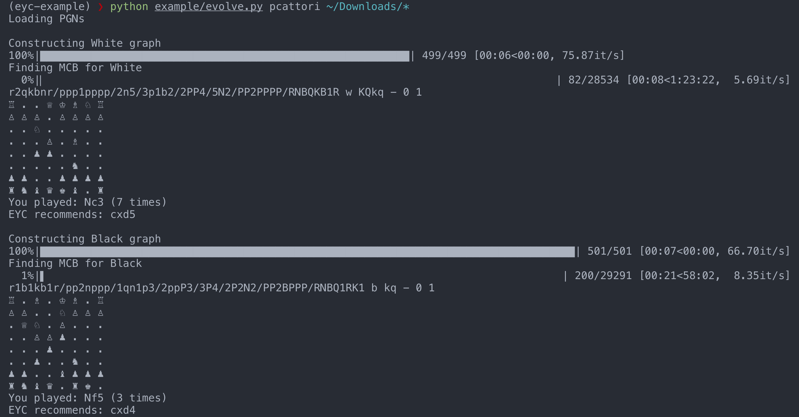
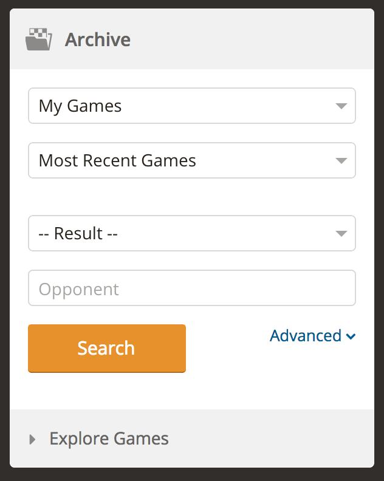

# evolve-your-chess (EYC)

Improve your chess via batch analysis and Darwinian selection!

In other words, let EYC find your "Most Common Blunder" (MCB).

:zap: Batteries included: Comes bundled with [Stockfish 8](https://stockfishchess.org/)

## Installing

```sh
$ git clone https://github.com/pcattori/evolve-your-chess
$ cd evolve-your-chess
$ pip install -e . # link to the library
```

## Running Example

```sh
$ cd evolve-your-chess
$ pip install -r example/requirements.txt
$ python example/evolve.py <your-chess.com-username> [... paths/to/pgns]
```

Example:



Some things to know:
- MCB stands for "Most Common Blunder"
- EYC sorts your moves by frequency and short-circuits once it finds the first move in that list that Stockfish considers a blunder. That's why the "Finding MCB" progress bars do not complete.

# Fetch utilities

## Install

```sh
$ pip install -e .[fetch]
```

## chess.com PGN fetcher

:zap: Batteries included: Comes bundled with [`chromedriver`](https://sites.google.com/a/chromium.org/chromedriver/) so that [selenium](https://github.com/SeleniumHQ/selenium) can download PGNs for you.

*Requires:* [ChromeDriver expects you to have Chrome installed in the default location for your platform.](https://sites.google.com/a/chromium.org/chromedriver/getting-started)

```sh
python fetch/chess_dot_com_pgns.py --output <path/to/output-directory>
```

Downloads PGNs from [your chess.com archives](https://www.chess.com/games/archive).

For short, you can use `-o` for `--output`.

You can specify a number of chess.com archive pages with the `-p` or `--pages` flag.

You can specify a different selenium driver by providing the path to the driver via the `-d` or `--driver` flag.

### Advanced search

You can leverage chess.com's advanced search capabilities to specify which games to download.

1. Navigate to [your chess.com archives](https://www.chess.com/games/archive).
2. Click  "Advanced" in the Archive search panel.
    
3. Set your search filters in the Archive advanced search panel
    
4. Click "Search"
5. Copy the URL that appears in your browser

Pass that URL (surrounded by quotes) to the fetcher via the `-f` or `--filter-url` flag.

Make sure your search actually returned some results on chess.com first!

## ECO JSON fetcher

```sh
python fetch/eco.py
```

will print newline-delimited ECO records to your stdout.

